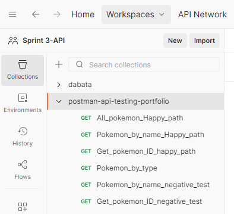
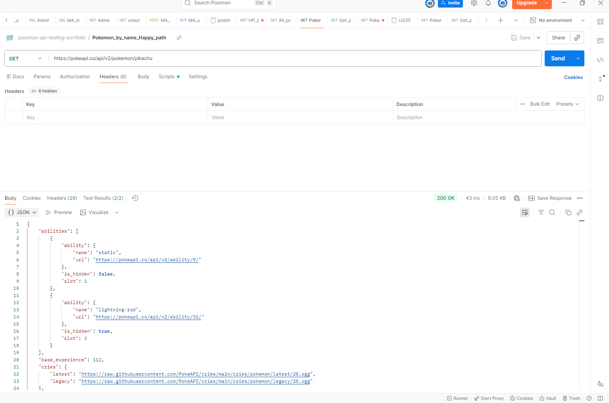
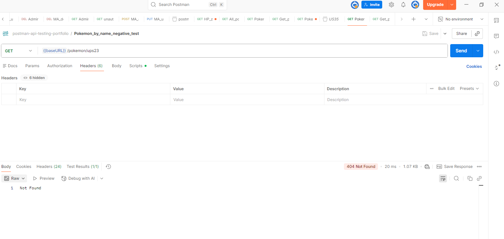
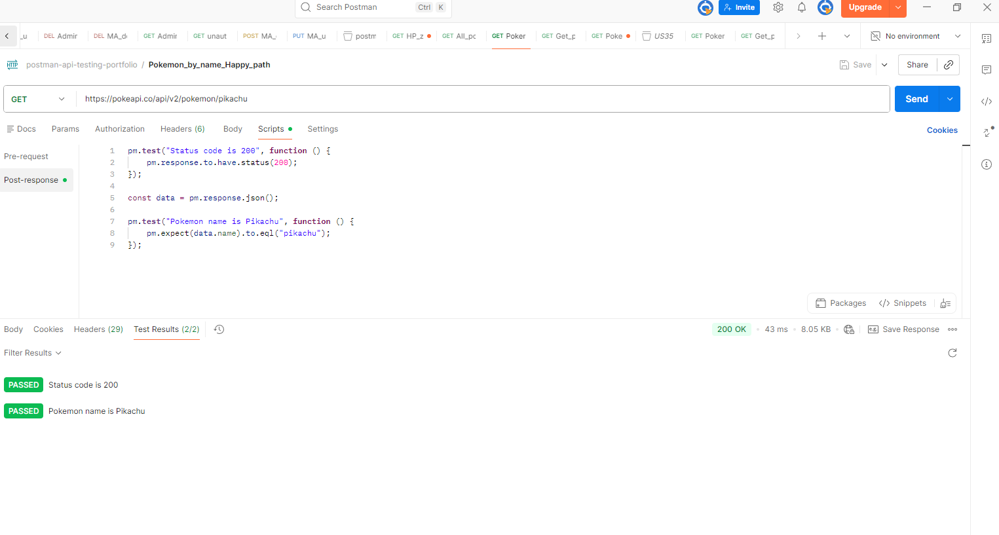
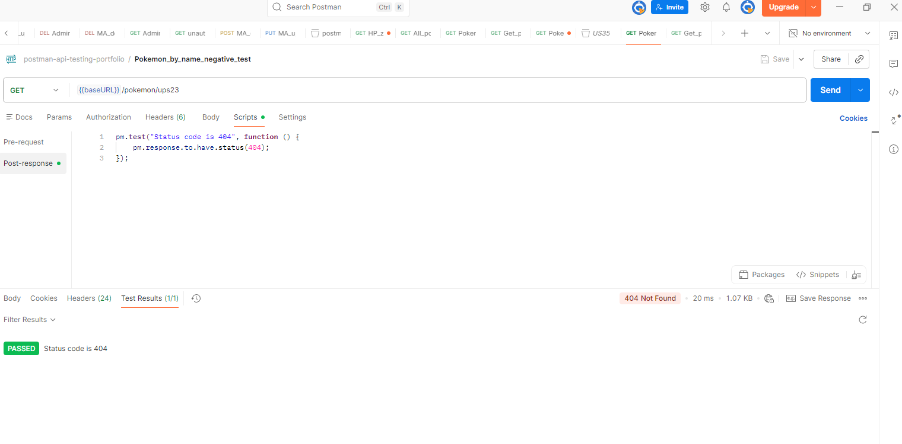

# pokemon-api-testing

## Přehled

Tento projekt ukazuje **testování API** pomocí Postmanu a veřejného REST API PokéAPI.

Cílem projektu je ukázat:
- testování REST API
- pozitivní a negativní testovací scénáře
- validaci odpovědí API
- základní dokumentaci testování

---

## Testované API

- https://pokeapi.co/

---

##  Testované endpointy

| Metoda | Endpoint | Popis |
|--------|----------|------|
| GET | /api/v2/pokemon/{name} | Získání Pokémona podle jména |
| GET | /api/v2/pokemon/{id} | Získání Pokémona podle ID |
| GET | /api/v2/pokemon | Seznam všech Pokémonů |
| GET | /api/v2/type/{type} | Získání Pokémonů podle typu |

---

## Testovací scénáře

### Pozitivní scénáře

- Ověření status kódu **200**
- Ověření správného jména Pokémona
- Ověření správného ID Pokémona
- Validace struktury JSON odpovědi

---

### Negativní scénáře

- Ověření status kódu **404** pro neplatné jméno Pokémona
- Ověření status kódu **404** pro neplatné ID Pokémona
- Ověření chybové odpovědi API

---

## Použité nástroje

- Postman
- REST API
- JSON
- GitHub

---

## Screenshots

### Postman collection

### API Request & Response Example

### Automated test

---
## Závěr testování

Na základě provedených testů bylo ověřeno, že API PokéAPI funguje správně pro pozitivní i negativní scénáře.

### Shrnutí výsledků:
- API vrací správné HTTP status kódy (200 pro validní požadavky, 404 pro neplatné vstupy)
- JSON odpovědi mají očekávanou strukturu a datové typy
- Negativní scénáře jsou správně ošetřeny chybovými odpověďmi

Testování neodhalilo žádné kritické chyby.
